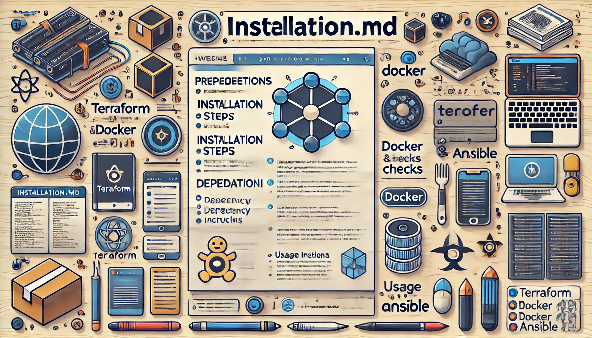

## Prerequisites

Before setting up the project, ensure you have the following tools installed:

- **Docker**: Install Docker to run containers. [Docker Installation Guide](https://docs.docker.com/get-docker/)
- **Terraform**: Install Terraform to configure infrastructure. [Terraform Installation Guide](https://developer.hashicorp.com/terraform/tutorials/aws-get-started/install-cli)
- **Ansible**: Install Ansible for configuration management and automation. [Ansible Installation Guide](https://docs.ansible.com/ansible/latest/installation_guide/intro_installation.html)
- **Git**: Install Git to clone the repository. [Git Installation Guide](https://git-scm.com/book/en/v2/Getting-Started-Installing-Git)

## Installation Steps

1. **Clone the Repository**

   Clone the repository and navigate to the project directory:

   ```bash
   git clone https://github.com/orinahum/terraform_single_docker.git
   cd terraform_single_docker
   ```

2. **Run the Setup Script**

   To install and deploy the infrastructure, run the `setup.sh` script provided in the project. The script is interactive and offers both installation and uninstallation options:

   - To run the installation:

     ```bash
     ./setup.sh
     ```

     This script will perform the following steps:
     
     - **Check Dependencies**: Verifies if required tools (Terraform, Docker, and Ansible) are installed.
     - **Apply Terraform Configuration**: Uses Terraform to create the infrastructure and outputs the plan to a log file (`terraform_apply_output.log`).
     - **Run Ansible Playbook**: Executes the Ansible playbook to configure NGINX with the necessary settings.

   - To uninstall (destroy the infrastructure):

     ```bash
     ./setup.sh --uninstall
     ```

     This command will destroy all infrastructure created by Terraform.

## Step-by-Step Explanation of setup.sh Script

### Prerequisite Checks

- **Dependency Check**: The script starts by checking if Terraform, Docker, and Ansible are available on your system. If any of these tools are missing, the script will exit with an appropriate error message. This ensures that all necessary tools are in place before proceeding.

### Installation Option (Default)

- **Terraform Apply**: The script then runs `terraform apply` to create the infrastructure in the `terraform/` directory. The output of the plan is logged to a file called `terraform_apply_output.log` for reference. This command provisions the required Docker containers as specified in the Terraform configuration.

- **Run Ansible Playbook**: After Terraform has provisioned the infrastructure, the script uses Ansible to perform additional configuration on the infrastructure, such as setting up NGINX with the proper configuration files. This ensures that the application environment is correctly configured and ready for use.

### Uninstall Option (`--uninstall`)

- **Terraform Destroy**: If the script is run with the `--uninstall` flag, it will attempt to destroy all resources created during the installation using `terraform destroy`. If the destroy process fails, an error message along with the specific error details will be displayed.

## Access the Application

Once the deployment is complete, you can access the application via the NGINX load balancer using the configured DNS name (e.g., `https://example.local`). Make sure your system's hosts file includes an entry mapping this DNS name to the NGINX container's IP address.

## Clean Up Resources

To destroy the infrastructure and remove all created resources, run:

```bash
./setup.sh --uninstall
```

This command will safely remove all resources that were previously deployed.

## Related Documents

- [Project Overview (README.md)](README.md)
- [SSL Guide (SSLGUID.md)](nginx_files/ssl/SSLGUID.md)
